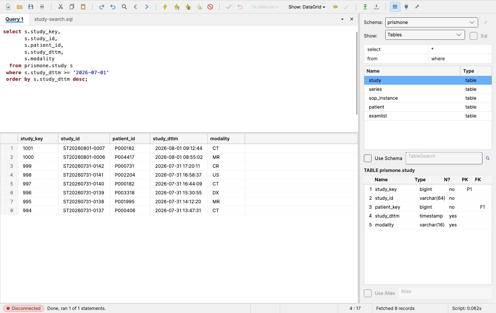
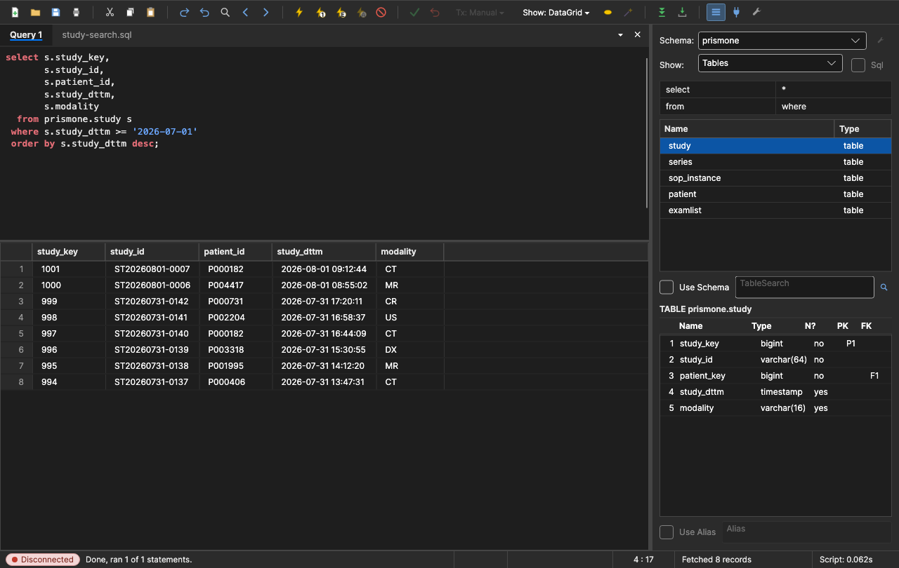
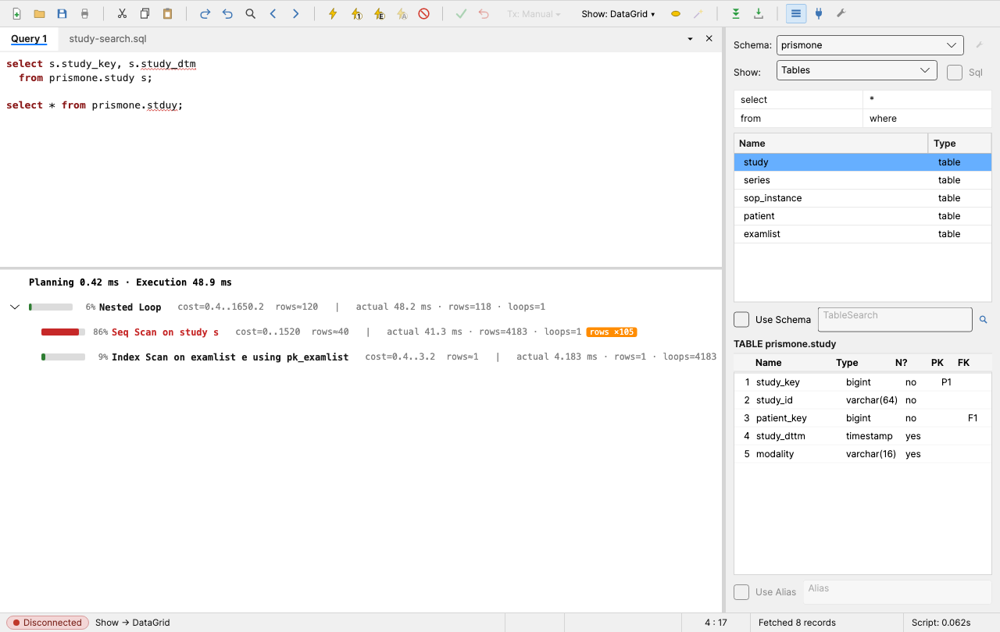
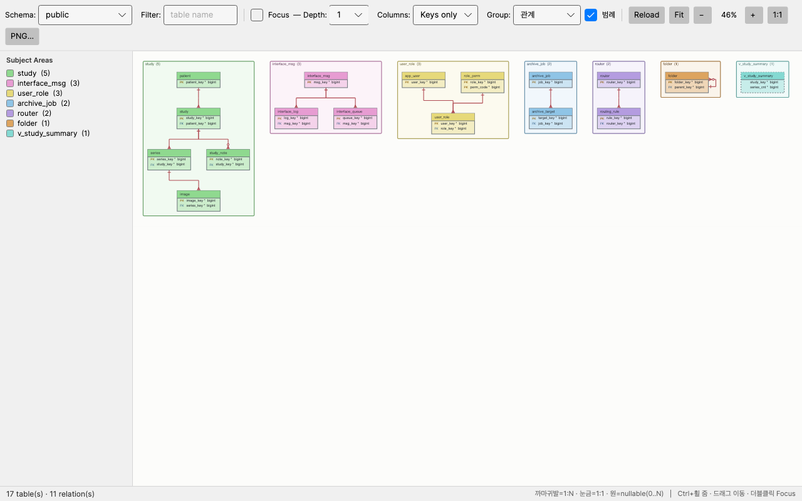

# Aurum

**Au(금, 79)** — Oracle 시절 쓰던 Benthic **Golden** 의 후계자.
**PostgreSQL · Oracle · SQLite** 를 지원하는 데스크톱 DB 쿼리 툴로, Golden 의
가벼움·키맵·세션 모델을 그대로 유지하면서 DataGrip 의 "스키마를 아는" 기능
(introspection 캐시 · SQL 검증 · Explain Plan 시각화 · ERD · Schema Diff)을 얹었다.
.NET 10 + Avalonia 12 (Windows · macOS · Linux), 외부 라이브러리 최소.

| 라이트 (기본, Golden 배색) | 다크 |
|---|---|
|  |  |

## 주요 기능

**쿼리 실행 (Golden 파리티 완료)**
- **F9** 커서 문장 실행 · **F5/Shift+Enter** 스크립트(커서부터 끝까지) · Cancel
- 공유 세션 모델 + 전용 세션 탭(Ctrl+Shift+T), 수동 커밋 기본(Ctrl+F5/F6),
  Tx Isolation 툴바
- **SSH 터널** — 점프(bastion) 호스트를 거쳐 접속. 비밀번호 · 개인키 · **ssh-agent/Pageant** ·
  **`~/.ssh/config`** 인증, **ProxyJump 다단 경유**, **호스트 키 확인**(known_hosts 대조 +
  지문 확인 창), 여러 접속이 나눠 쓰는 **이름 붙인 설정**, 대상마다 터널 하나를 재사용
  (PG · Oracle · MongoDB)
- 실행 즉시 전체 fetch(5만 행 안전 상한) 또는 점진 fetch — 결과는
  DataGrid / Text / Log 3종 보기(F12), 결과 스냅샷을 새 창에 고정(Pin)
- **Run and Edit(F11)** — 그리드에서 셀 수정·행 추가·삭제 → ✓ Post 후 Commit/Rollback (Golden EditMode)
- 내보내기: CSV(COPY) · TSV · INSERT · **xlsx**(외부 라이브러리 없이 10만 행 ≈ 0.2초)
- **CSV/TSV Import** — 헤더 매핑, 전량 성공 아니면 전량 롤백
- Favorites(앱 내 쿼리 저장) · **Query History 조회 창**(시각·검색) · 워크스페이스

**스키마를 아는 에디터**
- 자동완성(테이블·컬럼·별칭 해석, 3개 DB 공통) — introspection 캐시로 접속 왕복 없음
- **SQL 검증** — 없는 테이블/컬럼에 빨간 물결 밑줄 + 툴팁 (실행 전에 오타를 잡는다)
- **Explain Plan 시각화** — 노드별 self 비용 막대·%·행수 예측 오차 배지 (PG)



**스키마 도구 (읽기 전용 — DDL 을 만들지 않는다)**
- **ERD** (Tools > Diagram) — FK 관계·카디널리티 추론, Focus(선택+N홉), PNG 저장
- **Schema Diff** — 표준 스키마 스냅샷(JSON)과 현재 접속을 비교. 패치 누락·드리프트 탐지
- Object Browser(F8) · describe(Ctrl+D) · Session Monitor · 스키마 버전 pill



**UI**
- 라이트(기본, Golden 배색) / 다크 / 시스템 테마 — **View > Dark Mode** 로 즉시 전환
- 창 위치·크기 기억, 긴 작업 진행 표시, 모든 다이얼로그 Esc 닫기

전체 사용법은 **[docs/USER_GUIDE.md](docs/USER_GUIDE.md)** 참조.

## 빠른 시작

1. **실행** — 배포본(`Aurum.app` / `Aurum.exe`)을 실행하면 로그온 창이 뜬다.
2. **접속** — Type(PostgreSQL/Oracle/SQLite) 선택, `host[:port]/database` + 계정 입력.
   접속 정보는 AES-256-GCM 으로 암호화되어 `~/.prismone-studio/` 에 저장된다.
   DB 포트가 막혀 있으면 **SSH Tunnel** 을 켜고 점프 호스트를 지정한다 (DataGrip 과 같은 방식).
3. **실행** — 에디터에 SQL 을 쓰고 **F9**. 자동완성은 `.` 입력 또는 Ctrl+Space.
4. 이후는 키맵이 곧 사용법이다:

| 키 | 동작 |
|---|---|
| Ctrl+L | 로그온 (Login List) |
| F9 / F5 | 문장 실행 / 스크립트 실행 |
| Ctrl+F5 / Ctrl+F6 | Commit / Rollback |
| F8 | Object Browser |
| Ctrl+D | 커서 위치 테이블 describe |
| F11 | Run and Edit (그리드 편집) |
| F12 | 결과 보기 전환 (Grid/Text/Log) |
| Ctrl+End | 끝까지 fetch |
| Ctrl+↑/↓ | 히스토리 순환 (조회 창은 Tools > Query History) |
| Ctrl+Shift+F | 즐겨찾기 추가 |
| Ctrl+O / Ctrl+S | SQL 파일 열기 / 저장 |

## 위치

원래 [iap-database](https://github.com/inftai111/iap-database) repo 의 `tools/` 로
시작했고 2026-08 에 분리했다. **DB 초기 설치·패치 CLI(`iapdb`)는 iap-database 에
남아 있다** — 설계 원칙: 초기화·패치는 배포 키트(iapdb + sql/ + patches/)의 몫이고,
Aurum 은 스키마 버전에 종속되지 않는 조회·관리 도구다. 그래서 Aurum 의 스키마
도구는 전부 읽기 전용이며 동기화 DDL 을 생성하지 않는다.

## 구조

```
Aurum.sln
src/
  PrismOne.Db.Core/    # 드라이버 중립 코어: 세션·fetch·편집·export/import·카탈로그·diff·검증 (테스트 281개)
  PrismOne.Studio/     # GUI (제품명 Aurum) — 네임스페이스는 역사적 이유로 PrismOne.Studio 유지
tests/
  PrismOne.Db.Core.Tests/
packaging/             # macOS .app · Windows 단일 exe
docs/                  # 사용법·설계 문서 (아래 문서 지도)
```

| 문서 | 내용 |
|---|---|
| [USER_GUIDE.md](docs/USER_GUIDE.md) | **사용법 전체** |
| [STATUS.md](docs/STATUS.md) | 진행 상황 · 다음 작업 (인수인계용) |
| [TOOL_COMPARISON.md](docs/TOOL_COMPARISON.md) | Golden vs DataGrip — 무엇을 취하고 버렸나 |
| [DATAGRIP_GAP.md](docs/DATAGRIP_GAP.md) | DataGrip 대비 갭과 구현 기록 |
| [MULTI_DB_PLAN.md](docs/MULTI_DB_PLAN.md) | 멀티 DB 계획 (PG/Oracle/SQLite/MongoDB) |
| [UI_POLISH.md](docs/UI_POLISH.md) | UI 로드맵 (P1 완료 · P2 진행 예정) |

## 빌드 · 배포

```bash
# .NET 10 SDK 필요
dotnet build Aurum.sln
dotnet test tests/PrismOne.Db.Core.Tests
dotnet run --project src/PrismOne.Studio
```

배포 패키지:

```bash
sh packaging/macos/make-app.sh          # → dist/Aurum.app
```

```powershell
powershell -ExecutionPolicy Bypass -File packaging/windows/make-app.ps1
# → dist/Aurum/Aurum.exe (self-contained 단일 exe, 약 48MB)
```

> `packaging/**/*.ps1` 은 **UTF-8 BOM** 으로 저장한다. PowerShell 5.1 은 BOM 없는
> UTF-8 을 CP949 로 읽어 한글 주석이 깨지면서 스크립트 파싱이 어긋난다.

## 설치 · 자동 업데이트

설치본은 [GitHub Releases](https://github.com/HyeonGiMin/Aurum/releases/latest) 에서 받는다
(Windows `Aurum-win-Setup.exe`, macOS `Aurum-osx-arm64.pkg`). Setup 으로 설치한 본은
**시작할 때 — 로그온 창보다 먼저 — 새 릴리즈를 확인해 팝업으로 알리고, Update 를 누르면
내려받아 다시 시작**한다 (Velopack). 접속해서 일을 시작한 뒤에 재시작을 요구하지 않으려는 것이고,
네트워크가 느리면 4초만 기다렸다 로그온을 먼저 띄운다. 팝업은 현재→새 버전, 내려받을 용량
(델타가 있으면 그만큼만), 릴리즈 노트를 보여준다.
Help > Check for Updates 로 직접 확인할 수도 있고, Options 에서 시작 시 확인을 끌 수 있다.
위의 zip / 단일 exe 본은 자동 업데이트가 되지 않는다.

릴리즈 절차 — 태그를 밀면 `.github/workflows/release.yml` 이 두 플랫폼을 빌드해 Release 에 올린다:

```bash
git tag v0.4.0 && git push origin v0.4.0
```

로컬에서 Setup/업데이트 패키지를 미리 만들어 보려면:

```powershell
powershell -ExecutionPolicy Bypass -File packaging/velopack/pack.ps1 -Version 0.4.0
# → dist/releases/Aurum-win-Setup.exe 등
```

## 자가 검증 (스크린샷 하니스)

화면 회귀는 사람 눈이 아니라 스크린샷으로 잡는다:

```bash
IAPDM_SHOT_DIR=/tmp/shots dotnet run --project src/PrismOne.Studio   # 샘플 데이터 12종 캡처
IAPDM_SHOT_THEME=dark ...                                            # 다크 테마 변형
# IAPDM_SHOT_CONN="host[:port]/db|user|pass" 를 주면 실접속 재현 (+IAPDM_SHOT_RAE=1 은 편집 검증)
# 앱 아이콘 재생성: IAPDM_RENDER_ICON=<png경로>
```
